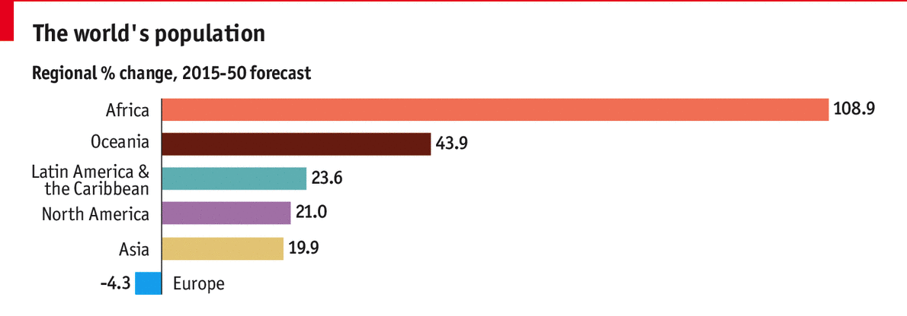
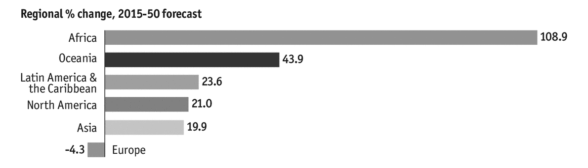

Over at [StorytellingwithData](http://www.storytellingwithdata.com/), Cole asked readers to participate in a data visualization challenge. The goal was to take the following set of visuals and improve them.

### Global Population Forecasts

I haven't created graphics in a few months so I thought this was the perfect opportunity to play with some tools (Tableau Public, Excel, and R) and to see what I could create. Before jumping into the tools, I wanted to analyze the graphics to understand the data they displayed and the story they told. I used Kaiser Fung's [Trifecta Checkup](http://junkcharts.typepad.com/junk_charts/junk-charts-trifecta-checkup-the-definitive-guide.html) to aid my thinking. Here's a bit more about that Checkup.

Taken from Kaiser's site, [Junk Charts](http://junkcharts.typepad.com/)...

>In putting this framework together, I aimed to make it simple to use and broadly applicable. The Trifecta Checkup involves only three investigations:
>
>What is the QUESTION?
>
>What does the DATA say?
>
>What does the VISUAL say?

Before I show my visualization (in the next post), I'll address the three questions from the Trifecta Checkup and discuss the strengths and weaknesses of each of the graphics in their current form.

## The Question

First, I thought about the question that the graphics attempted to answer.

The first graphic displays the percent change in each region of the world from 2015 to 2050. Africa is the clear winner with over 108% growth while Europe is the only region to show a percent decrease.

The second graphic shows the total population in 2015 and the forecasted population in 2050 and 2100. The total populatio is listed in billions at the end of each bar, and each bar is also colored by region so one can see the proportion that each region contributes to the overall population.

Finally, the third graphic shows the rank (vertical position of a country) and the population (length of the colored, horizontal bar) in billions of the most populous countries. The last graphic is particularly interesting since it includes data from the year 1950; this graphic shows past, present, and future data. Even with the addition of 1950 in the third graphic, I would say that overall these graphics are addressing the question "How will the world's population change from 2015 to 2050?".

## The Data

Next, I thought about the data that was used to generate these graphics. Overall, I'd say that the data team did a great job of pulling the data to showcase the current population in 2015 and the projected population in 2050. However, I think there were some choices in the graphics that take away from the story. For example in the second graphic, the creators of the graphic choose to include the forecast of the world's population in 2100. It's the only graphic that includes data beyond 2050. This also suggests that the creators had access to data more data and they choose not to show that data. For example, the creators might have included a second bar chart similar to the first one that shows the percent change in population from 2050-2100.

I'll come back to this point later, but I'd also like to call attention to one more aspect about the data that was chosen to the set of graphics. In the second graphic, the years are 2015, 2050, and 2100. The time intervals between the first two years is 35 years while the time interval between the last two years is 50 years. I found it odd to show these bars side by side when the time interval across the years is different. It makes the comparisons less reasonable and interprettable. I'm wondering what's happened in the past, and I'm wondering if the there will be large swings in population within each time interval. The same time problem can be found in third graphic with the years 1950, 2015, and 2050 (a 65 year interval and a 35 year interval).

## The Visuals

Finally, I looked at the visuals to determine how well they answer the question "How will the world's population change from 2015 to 2050?". The first graphic shows the percent change of the from 2015-2050 so this graphic certainly addresses the question directly. In terms of the actual visuals though, I'm not a big fan of the color scheme because I think Oceania's bar is too bold and saturated compared to the other pastel colors. Here's that same graphic in black and white. Both forms of the graphic emphasize Oceania while the focus should be on Africa.

The color scheme, however, is used consistently throughout the graphic so it is easy to associate regions with particular colors as reader's interpret the second and third graphics.

Other than the color scheme, the first visual is biased in that it only shows one slice of the data. The first visual takes one snap of time by focusing on the percent change from 2015-2050. I'm not sure if the changes are significant, and I'd like to contextualize the changes to what's happened in the past, but at least I'm able to compare the rates of change in population for each region. I think there is a better way to show this data, which I'll share in the next post.

My final consideration for the visuals lies in the third graphic. I like how the countries can be traced visually as they change position. My biggest question is what were the populations of the African countries in 1950 and where would they rank. I think there's a lot of visual noise with the y-axis lines (at 0, 1, and 2), the minor dashed gridlines (especially between the horizontal bars), and the colored bars. If you're wondering how the visual noise is created, check out [1+1=3](http://meiert.com/en/blog/20070118/1-1-3-explaining-busyness-and-background-noise-on-websites/). Lighter shades of grey would reduce the visual noise, and I'd lean towards omitting the minor dashed grid lines. The last graphic does succeed by bolding the text '2050 Forecast'. The bold label reinforces the question being answered by the data and helps reader's focus on the most important data in this graphic, namely what the world population will be in 2050.

That's the breakdown of the current graphic. In my next post, I'll share a remake and the choices that I made to create it.

