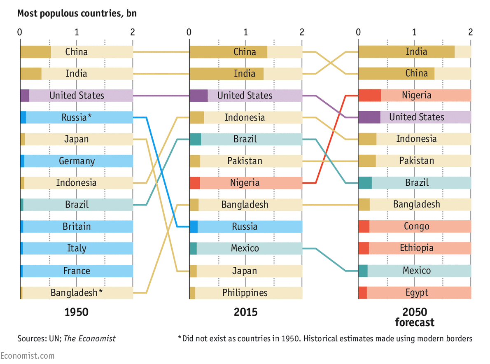

In my last post, I analyzed the following graphics in the article [Global Population Forecasts](http://www.economist.com/blogs/graphicdetail/2015/08/daily-chart-growth-areas). I discussed the strengths and weaknesses of the graphics, and I explained that the graphics attempted to answer the question "How will the world's population change from 2015 to 2050?". Here are those graphics again.

Now I'd like to share my remake and offer a different question that my graphics are attempting to answer. One of the missed opportunities of the original graphics is that they don't make use of historical data. They don't include data about regional changes prior to 2015, which makes it difficult for readers to put the future population projections in context. I think the more interesting story for the graphics concerns how the world population has changed in the past and how it will change in the future.

## The Question

The question that my graphics answer is "How has the world population changed in the last 65 years, and how will it change in the next 65 years?". The UN publishes data back to 1950 so I thought it was only fitting to include all of the data and use a similar time interval when it came to looking at projections. Here's the remake.

Each graphic has a title, and the first three graphics have a subtitle. These serve to focus the reader's attention prior to entering the graphic. This is one of the keys to great explanatory graphics. By including a title and subtitle, the reader knows the main takeaway from a graphic before even looking at any visuals. To further focus the reader's attention, I used color sparingly to draw attention to population changes in Africa and Asia. Most of the world's population growth will come from Africa in the next 65 years so I thought it was best to highlight Africa throughout the graphics. I used Asia as a comparison since Asia has experienced significant growth in the past and because it's population growth is projected to slow in the future. Any data that isn't central to the main narrative typically shows up in a grey color in the visual to reduce attention to that data.

## The Data

In creating the graphics, I thought about the story that the data *could* tell, and I took the following key points from the Economist article to help choose the chart types.

- The world's population will reach over 11 billion by 2100.
- More than half of the world's population growth will come from Africa.
- China and India's populations will peak.
- Nigeria over takes the United States for the 3rd most populous country.

I'd also like to add two more points to that list which surfaced as I started looking at historical data.

- African countries continue to show strong growth from 1950-2015.
- China's population will decrease in the coming years.

## The Visuals

In order to showcase these findings, I knew that I needed to display the absolute population numbers for the world and the world's regions. I also needed to show how each region's percent contribution to the world population changed over time. Showing both absolute changes and part-to-whole relationships over time can be tricky. There's many options available such as pie charts, stacked bar charts, and stacked area charts. [Stephen Few](http://www.perceptualedge.com/about.php), wrote about many of these option in his excellent article, ["Quantitative Displays for Combining Time-Series and Part-To-Whole Relationships"](https://www.perceptualedge.com/articles/visual_business_intelligence/displays_for_combining_time-series_and_part-to-whole.pdf). I took his advice and used two line graphs aligned to a common horizontal time axis to show the changes over time.

These two line graphics show data from 1950-2080, and they show far more data than the original bar chart.

The second line chart in particular shows the regional composition of the world in every year from 1950-2080. The original graphic (shown below) only showed the regional composition for 2015, 2050, and 2100.

My first two line graphs replace both of the bar charts and showcase the relationship between absolute population changes and percent composition of world's population in greater detail.

The original version of my first line chart, however, did contain some additional data that I omitted. 

Notice that the lines for Europe, North America, Latin America, and Oceania cluster near the bottom of the chart. The regional changes in population are relatively unnoticeable given the range of the y-axis. As a result, I decided to remove these lines from the graphic (and now that I think about it I should probably have removed them from the second line chart as well). I didn't think it was worth pulling those regions into their own graphic since I wanted the graphics to focus on changes in Africa and Asia. The last changes I made to the graphic included centering the title and subtitle and coloring the labels to match their lines.

The next big visual is the [slope graph](http://www.storytellingwithdata.com/blog/2014/03/more-on-slopegraphs). The slope graph that I created was meant to replace the noisy ranked bar chart below.

#### Before

#### After

This new slope graph traces any country that was in the top ten most populous countries in 1950, 2015 and 2080. I used a log scale so that readers could more easily see the rate of change in population. I also showed two slope graphs: one from 1950-2015 and one from 2015-2080. The juxtaposition of the two slopes graphs and the use of blue to highlight African countries reinforces the strong population growth in Africa. Finally, I used an orange annotation to call attention to when India's population will surpass China's population.

I think the resulting slope graph is cleaner, but it can be improved. There's a lot of white space towards the top of the graphic that could be removed by having better limits on the y-axis. I couldn't get the appropriate y-axis limits using Excel, and I could not find a way to create such a custom slope graph in R. Other than that, the rest of the changes relate mostly to style. The labels for each country are too crowded in particular places so repositioning the labels or even omitting some countries or some countries' labels might have been a better alternative. Finally, the last change I would make concerns annotations. I should have included a note about Bangladesh and Russia. These two countries did not exists in 1950, and historical estimates were made using modern geographical borders.

The last graphic that I created was a bar chart. For the most populous countries in Africa and Asia, the bar chart displays the percent change in population followed by the absolute change in population. Countries are ranked by percent change.

The bar chart supports the interpretation of the slope graph and its findings, and it again calls attention to high projected growth rates in Africa. The bar chart also highlights a declining population in China, which is easy to miss in the ranked bar chart. Overall, I think this bar chart serves as a nice end to the visuals since the graphics have moved from a high level view of world and regional changes to a more narrowed view of specific country changes.

If you have any other ways to improve the original graphics or my remake, please let me know in the comments.

